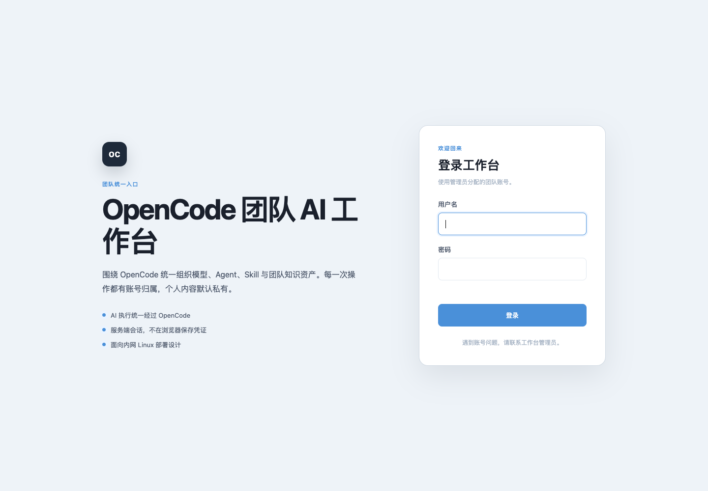
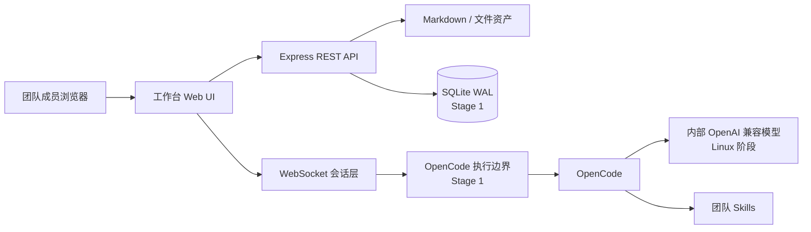
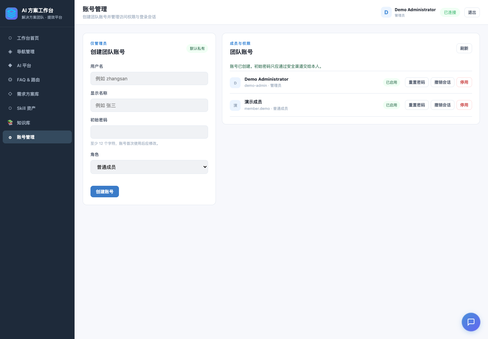

# OpenCode 团队 AI 工作台

面向 15–20 人内部团队的中心化 AI 工作台：成员通过浏览器使用 OpenCode、管理知识、沉淀方案，并逐步形成可校验、可发布、可回滚的团队 Skill 资产。

> 当前研发阶段：**Stage 0、Stage 1A–1E 已完成；Stage 2 已完成架构设计、尚未开发，项目尚未达到生产上线条件。** Mac 上已经跑通 React 前后端、用户名密码、角色权限、知识/方案私有闭环和无密钥 Demo；常驻 OpenCode Gateway、Linux 部署与生产验收仍未完成。

最新已验证交付：Stage 1E 主提交 [`9a205f5`](https://github.com/rainerzhao/opencode-ia/commit/9a205f5)，已于 2026-09-03 推送到公开仓库 `main`。该版本完成 React/Vite 迁移与 Stage 1 总验收；Stage 2 Gateway 仍是已确认设计，不应误读为已经实现。

[查看完整路线图](docs/ROADMAP.md) · [查看 Stage 2 Gateway 设计](docs/architecture/stage-2-opencode-gateway.md) · [查看验收报告](docs/dev-loop-runs/2026-09-01-stage-1-product-foundation/04-acceptance-report.md) · [查看架构设计](docs/superpowers/specs/2026-09-01-team-ai-workbench-design.md)



## 三分钟体验

无需 OpenCode、模型服务或 API Key，即可启动完整前后端 Demo：

```bash
git clone https://github.com/rainerzhao/opencode-ia.git
cd opencode-ia
npm ci
npm run demo
```

打开终端显示的地址，默认是 `http://127.0.0.1:4317`。脚本会为本次临时环境生成随机密码的 `demo-admin`，账号和密码只输出到当前终端。用该账号登录后，可以体验完整工作台、账号管理和受认证保护的 REST/WebSocket 链路。

Demo 会：

- 启动真实 Express、REST API 和 WebSocket 前后端链路；
- 提供 React 登录、退出、当前角色和管理员账号管理界面；
- 支持知识搜索、新建、编辑、上传，以及对话人工确认后沉淀为私有方案；
- 只监听本机回环地址 `127.0.0.1`，不会对局域网开放无认证服务；
- 展示三篇示例知识文档；
- 使用明确标注的“Demo 模拟回复”，不调用真实模型；
- 把所有可写数据放进系统临时目录；
- 按 `Ctrl+C` 后关闭服务并删除临时数据。

如需指定端口：

```bash
DEMO_PORT=4321 npm run demo
```

## 当前能看到什么

| 能力 | 当前状态 | 说明 |
| --- | --- | --- |
| 工作台前端 | ✅ Stage 1E | React/Vite、本地资源、登录、角色导航、账号管理、知识和方案闭环已跑通 |
| OpenCode 调用边界 | ✅ 已加固 | 参数化执行、超时、取消、输出限制、错误脱敏 |
| 多会话控制 | ✅ 基线完成 | 全局会话上限、单会话串行、断线和关服取消 |
| 知识文件与上传 | ✅ 基线完成 | 路径、符号链接、上传暂存、失败回滚保护 |
| URL 导入 | ✅ 默认关闭 | 白名单、DNS 地址校验、逐跳重定向、超时和大小限制 |
| 用户名/密码 | ✅ Stage 1B | 登录、退出、当前用户、改密、Session 撤销和限速 |
| 角色与账号管理 | ✅ Stage 1D | 管理员建号、密码重置、启停、会话撤销；成员界面不展示管理入口 |
| SQLite 数据层 | ✅ Stage 1A | WAL、版本化迁移、用户/Session/审计仓储 |
| 常驻 OpenCode Gateway | 📝 Stage 2 已设计 | 当前仍是每条消息一次有界 `opencode run`；目标为 Gateway + 2–4 Worker + 多 Session |
| Skill 发布中心 | ⏳ Stage 4 | 校验、版本、安装、启用、回滚和归档 |
| Linux 生产部署 | ⏳ Stage 5 | 内部模型、备份、监控和 15–20 人容量验收 |

## 产品原则

- 所有模型推理、Agent、Skill 和工具执行必须经过 OpenCode；工作台不直连模型 API。
- 对话和个人产物默认私有，用户明确确认后才能发布为团队知识或解决方案。
- 普通成员可以开发 Skill；发布前必须经过自动校验，并保留版本、禁用和回滚能力。
- AI 辅助处理和生成，人负责判断、风险复核与最终交付。
- IP 只可用于网络层限制，不作为用户身份；审计身份来自账号登录。

## 架构概览



当前使用 React/Vite 前端 + 模块化 Express 后端，账号、SQLite、私有知识和方案底座已经接通。Stage 2 将把每消息进程模式替换为“一个常驻 Gateway + 多个常驻 OpenCode Worker + 多个逻辑 Session”；Mac 从 2 个 Worker 起步，Linux 根据压测在 2–4 个间调整。

## 真实模式：Mac 开发启动

### 要求

- macOS（当前开发和验收环境）
- Node.js 24.x（已验证：24.15.0）
- npm 11.x
- 已安装并能独立运行的 OpenCode

安装依赖：

```bash
npm ci
```

复制并检查环境变量：

```bash
cp .env.example .env
```

至少确认 `OPENCODE_CMD` 和 `OPENCODE_CWD`。项目不接收模型 API Key；Provider 地址和凭证只配置在 OpenCode 自己的受保护环境中。

```bash
set -a
. ./.env
set +a
npm start
```

默认打开 `http://127.0.0.1:3000`。

## 配置

| 变量 | 默认值 | 用途 |
| --- | --- | --- |
| `WORKBENCH_ROOT` | 项目目录 | 工作台文件根目录 |
| `PORT` | `3000` | HTTP/WebSocket 端口 |
| `MAX_SESSIONS` | `20` | WebSocket 全局会话上限 |
| `OPENCODE_CMD` | `$HOME/.opencode/bin/opencode` | OpenCode 可执行文件 |
| `OPENCODE_CWD` | 工作台根目录 | OpenCode 运行目录 |
| `OPENCODE_TIMEOUT_MS` | `120000` | 单次消息超时，单位毫秒 |
| `OPENCODE_MAX_OUTPUT_BYTES` | `10485760` | stdout 与 stderr 总字节上限 |
| `KNOWLEDGE_DIR` | `<root>/knowledge` | Markdown 知识目录 |
| `SOLUTIONS_DIR` | `<root>/solutions` | 方案目录 |
| `SKILLS_DIR` | `<root>/.opencode/skills` | Skill 展示目录 |
| `DATABASE_PATH` | `<root>/data/workbench.db` | SQLite 运行数据库；被 Git 忽略 |
| `UPLOAD_TEMP_DIR` | `<root>/data/tmp/uploads` | 上传暂存目录 |
| `COOKIE_SECURE` | 生产环境为 `true` | HTTPS 下为认证 Cookie 增加 `Secure` |
| `SESSION_TTL_SECONDS` | `28800` | 登录 Session 有效期，单位秒 |
| `LOGIN_MAX_FAILURES` | `5` | 登录窗口内最大失败次数 |
| `LOGIN_WINDOW_SECONDS` | `900` | 登录失败统计窗口，单位秒 |
| `LOGIN_LOCK_SECONDS` | `900` | 触发限速后的锁定时长，单位秒 |
| `KNOWLEDGE_FETCH_ALLOWED_HOSTS` | 空 | URL 导入精确主机白名单 |

URL 导入默认禁用。启用后不支持通配符，非默认端口必须写为 `host:port`；每次重定向都会重新校验，回环、链路本地、云元数据和未授权地址会被拒绝。

### Stage 1A：创建首位管理员

首次初始化使用本机交互式命令，不提供默认账号，也不接受密码命令参数：

```bash
npm run admin:create -- --username admin --display-name 管理员
```

密码会隐藏输入两次，并使用 `scrypt` 和独立随机盐保存。

### Stage 1B–1E：认证、业务权限与 React 浏览器体验

当前已提供并接入前端的能力：

- `POST /api/auth/login`、`POST /api/auth/logout`、`GET /api/auth/me`；
- `POST /api/auth/change-password`；
- `GET/POST /api/admin/users`；
- 管理员密码重置、账号启停和 Session 强制撤销接口。
- 所有业务 REST 和 WebSocket 强制登录，业务写请求强制 CSRF；
- 方案和知识草稿按登录用户默认私有，成员之间不可互读；
- WebSocket 绑定 `userId`、角色和登录 Session，执行前重新验证撤销状态；
- 关键知识、方案和 OpenCode 执行动作写入脱敏审计。
- 浏览器启动先调用 `/api/auth/me`，未登录跳转到独立登录页；不在 `localStorage`、`sessionStorage` 或 JavaScript 中保存 Session Token；
- 所有业务请求统一经过认证客户端，写请求自动携带服务端签发的 CSRF 值；
- 管理员页面支持建号、遮蔽输入的密码重置、账号启停和 Session 撤销；普通成员看不到管理入口；
- 知识页面支持搜索、新建 Markdown、查看/编辑和安全上传；私人知识按账号隔离；
- AI 对话通过认证 WebSocket 接入 OpenCode，用户明确点击后才能把对话沉淀为私人方案；
- 需求方案从浏览器本地存储迁移到服务端私有方案目录。

Session 使用高熵不透明 Cookie，数据库只保存 SHA-256 摘要；写操作同时校验 Session Cookie、可读 CSRF Cookie、`X-CSRF-Token` 请求头与数据库摘要。`npm run demo` 使用隔离临时目录、随机临时账号和本地模拟 OpenCode，不调用真实模型或密钥。

## 验证与安全

```bash
npm test
npm run check
npm run security:scan
```

- 自动测试覆盖真实 HTTP/WebSocket、OpenCode 子进程、路径、上传、URL 安全边界及 React 前端契约；Stage 1E 当前共 118 项（提交前以最新全量输出为准）。
- 语法检查只检查仓库自有 JavaScript 文件。
- 密钥扫描只输出相对路径和规则名，不输出疑似密钥原文。
- `.env` 和本机运维交接文档被 Git 忽略；曾经暴露的 Provider Key 必须在 Provider 后台轮换。



## 已知限制与下一阶段

- Stage 1E 已完成 React/Vite 迁移；当前没有完整客户端路由和设计系统，后续按功能增长再引入，避免为首版过度设计。
- 当前每条消息调用一次有界 `opencode run`；多 Worker、持久会话、公平排队、恢复和模型目录留到 Stage 2 常驻 Gateway。
- 当前知识与方案使用文件系统作为 Stage 1 过渡层，尚未具备审核发布、版本和回滚闭环。
- 前端资源已全部本地打包，不依赖公共 CDN；真实 OpenCode 与内部模型尚未联调。
- 当前完成的是 Mac 开发验收，不代表公司内网 Linux 已达到生产标准。

下一阶段目标是 **Stage 2：常驻 OpenCode Gateway**。设计采用单机 SQLite、常驻 Gateway、2 个起步的 Worker 池和多逻辑 Session，不按用户固定进程，也不提前引入 Redis/Kubernetes。完整决策与验收标准见 [Stage 2 Gateway 架构](docs/architecture/stage-2-opencode-gateway.md)。

## 项目目录

```text
apps/web/     React/Vite 前端
apps/server/  生产服务组合入口
packages/     前后端共享契约
src/          后端、OpenCode 执行和安全策略
knowledge/    示例 Markdown 知识
scripts/      Demo、语法检查和密钥扫描
test/         Node 自动测试
docs/         架构设计、路线图和验收证据
server.js     兼容的生产模式薄启动入口
```

## Linux 迁移边界

生产目标是公司内网单台 Linux 服务器。迁移时保持工作台与模型配置分离，由非 root 进程运行，使用 Nginx 提供 HTTPS、反向代理和可选内网网段限制。

在账号、权限、SQLite 审计、备份恢复、内部模型联调和并发验收完成前，本项目只能用于开发和演示，不能宣称已生产上线。

## 参与开发

开始修改前先阅读 [ROADMAP](docs/ROADMAP.md) 和 [架构设计](docs/superpowers/specs/2026-09-01-team-ai-workbench-design.md)。提交前必须执行三项验证，并确保没有把真实 API Key、`.env`、运行数据或日志加入 Git。
