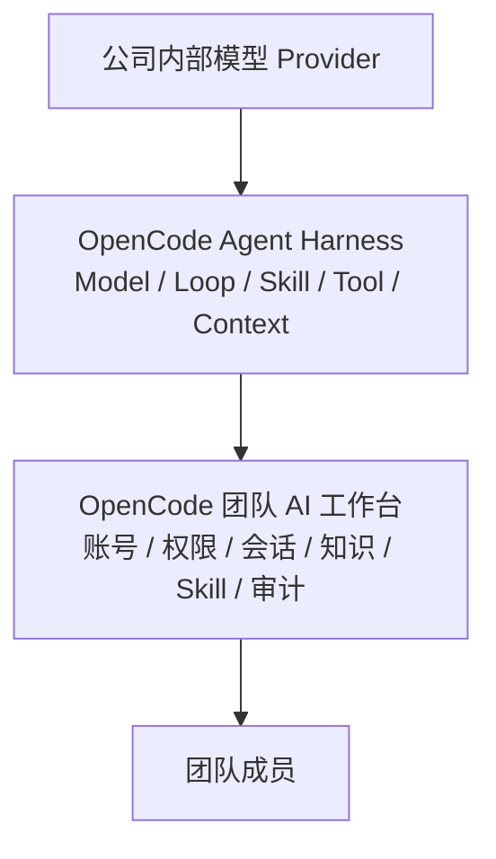
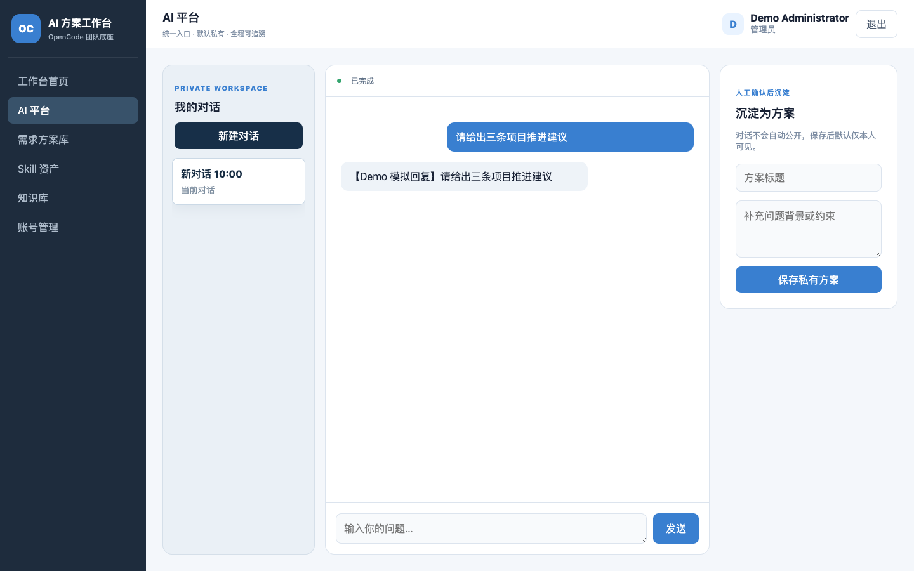
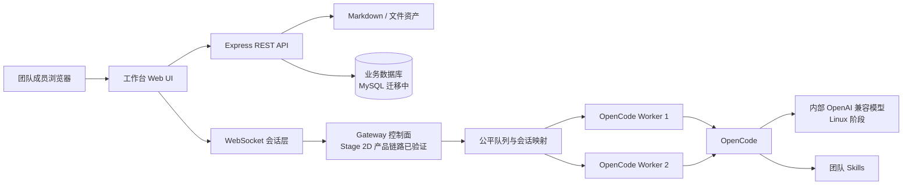
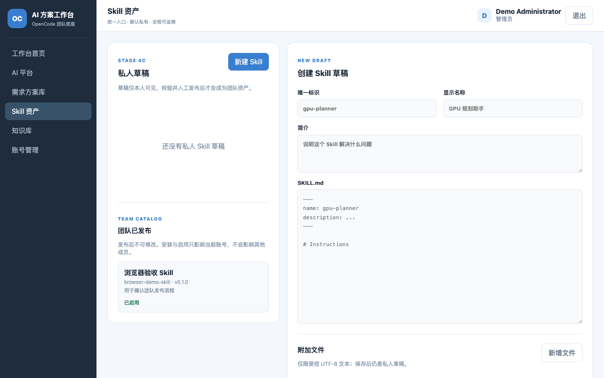

# OpenCode 团队 AI 工作台

> 让团队通过一个入口使用 AI，把一次次个人实践沉淀为可复用的团队能力。

OpenCode 团队 AI 工作台是一套面向内部团队的 AI 协作平台。成员无需各自配置模型、密钥和运行环境，通过浏览器登录后，就能使用统一的 AI 能力处理工作、管理个人知识、沉淀解决方案，并逐步共建团队 Skill 资产。

## 它在 Agent 世界中的位置

理解这个项目，可以先用一句话建立共同认知：**Agent = Model + Harness**。模型提供理解和生成能力，Harness 负责把模型接入上下文、工具、Skill 和持续运行的 Agent Loop，让 AI 能够真正执行任务。

在这个体系中，**OpenCode 是 Agent 执行引擎**：它连接公司内部模型，负责 Agent、Loop、Skill 和工具的实际运行；**本项目是建立在 OpenCode 之上的团队工作台**：它提供团队统一入口，并补齐多人使用所需的账号、权限、会话、知识、审计和资产治理能力。



因此，工作台不是另一个 Agent，也不替代 OpenCode。它解决的是如何把面向个人的 Agent 执行能力，建设成一个可供团队长期、集中、安全使用的内部 AI 工作平台。

## 它解决什么问题

- **统一使用入口：** 团队成员不再分别维护模型配置、工具链和本地环境。
- **保护个人空间：** 对话、知识和方案默认归属于创建者，不会自动变成团队公开内容。
- **沉淀工作成果：** 有价值的对话可以经过人工确认，继续整理为方案、知识和 Skill。
- **建立管理边界：** 账号、角色和操作记录统一管理，明确每一次操作由谁发起。
- **复用团队能力：** 让个人经验逐步变成所有成员都能找到、安装和使用的团队资产。

## 当前可以体验

- 使用管理员分配的用户名和密码登录；
- 创建和切换多个私人 Conversation，通过常驻 OpenCode Gateway 持续对话；
- 查看排队、运行、完成、中断等执行状态，并可停止任务；
- 搜索、新建、编辑和上传个人知识；
- 将确认过的对话保存为个人方案；
- 创建、编辑和归档自己的私人 Skill 草稿，维护受控附加文件并查看校验报告；
- 将已校验的私人 Skill 人工发布到团队目录；成员可各自安装、经 OpenCode 验证后启用；
- 为已发布 Skill 创建默认私有的新版本草稿；成员自主升级或回滚，升级/回滚后必须重新通过 OpenCode 验证；
- 由创建者或管理员停用并归档团队 Skill；停用后不会再被后续 Conversation 工作区发现；
- 由管理员创建账号、重置密码、停用账号和撤销登录会话；
- 在没有真实模型和密钥的情况下运行完整 Demo。

> 当前版本用于产品体验和持续研发。Stage 2 常驻 Gateway 已在 Mac 完成多人多会话、运行管理、崩溃恢复及 OpenCode 标准工具面的应用级隔离验收；Stage 3A–3C 已完成知识/方案版本化、FTS5、私有草稿、人工发布/撤回和来源追溯，Stage 3D 已完成 Knowledge 版本附件的私有存储、摘要校验、下载、文本/JSON/CSV 安全预览、受控知识包导出/导入、版本差异，以及 SQLite/MySQL 一致性备份与带附件摘要清单的恢复脚本；MySQL 真库恢复演练和完整验收仍在后续阶段。Stage 4A–4D 已完成默认私有草稿、校验、发布、按账号安装/启用、版本升级/回滚、停用/归档和真实 OpenCode 发现验证。项目已完成 MySQL 8.4 生产组合的代码级装配，并通过真实 MySQL + 模拟 Worker 的 HTTP/WebSocket 组合冒烟；内部 Provider、真实 OpenCode 全链路和 Linux 进程级沙箱仍在后续阶段。

[查看产品路线图](docs/ROADMAP.md) · [查看整体设计](docs/superpowers/specs/2026-09-01-team-ai-workbench-design.md) · [查看 Gateway 设计](docs/architecture/stage-2-opencode-gateway.md) · [查看内网部署手册](docs/operations/intranet-deployment.md)



## 三分钟体验

无需 OpenCode、模型服务或 API Key，即可启动完整前后端 Demo：

```bash
git clone https://github.com/rainerzhao/opencode-ia.git
cd opencode-ia
npm ci
npm run demo
```

打开终端显示的地址，默认是 `http://127.0.0.1:4317`。脚本会为本次临时环境生成随机密码的 `demo-admin`，账号和密码只输出到当前终端。用该账号登录后，可以体验完整工作台、账号管理和受认证保护的 REST/WebSocket 链路。

Demo 包含：

- 完整的登录、退出和账号管理体验；
- 知识搜索、新建、编辑和上传体验；
- 多 Conversation 对话、执行状态与“沉淀为方案”体验；
- 私人 Skill 草稿、附加文件和校验报告体验；
- 展示三篇示例知识文档；
- 使用明确标注的“Demo 模拟回复”，不调用真实模型；
- 所有数据只用于本次体验，关闭 Demo 后自动清理。

如需指定端口：

```bash
DEMO_PORT=4321 npm run demo
```

## 产品能力一览

| 产品能力 | 状态 | 用户可以做什么 |
| --- | --- | --- |
| AI 工作台 | ✅ 可体验 | 登录后使用对话、知识、方案和 Skill 入口 |
| 个人知识 | ✅ 可体验 | 搜索、新建、编辑和上传知识文件 |
| 个人方案 | ✅ 可体验 | 将人工确认过的对话沉淀为私有方案 |
| 账号与角色 | ✅ 可体验 | 管理员管理账号，普通成员只使用业务功能 |
| 数据与操作边界 | ✅ 已具备 | 个人内容默认私有，关键操作保留账号归属 |
| 多人在线使用 | ✅ 基础版可体验 | 多名成员可同时登录，私人 Conversation 和身份彼此隔离 |
| 常驻多会话 Gateway | ✅ Mac 已验收 | 多 Runtime/多 Session、公平排队、会话粘性、故障恢复、断线续传和 React 多会话已接通 |
| 运行管理 | ✅ Mac 可体验 | 管理员在账号管理页查看健康、Worker 和任务状态，二次确认取消任务；私人内容不向管理员展示 |
| 工具与产物边界 | ✅ Mac 应用级验收 | 每个账号和 Conversation 使用独立工作目录，默认关闭 Bash、联网、子代理和外部插件 |
| 私人 Skill 草稿 | ✅ Mac 可体验 | 成员创建、编辑和归档自己的 `SKILL.md` 草稿，默认不向团队公开 |
| 团队 Skill 中心 | ✅ Stage 4 已完成 Mac 验收 | 成员发布私有 Skill，独立安装/启用、升级/回滚；创建者或管理员可停用并归档，历史版本保留 |
| MySQL 单一数据层 | 🚧 Provider 验收中 | MySQL-only 生产组合及真实 MySQL HTTP/WebSocket 组合冒烟已通过；内部 Provider、真实 OpenCode 全链路和 Linux 切换仍在进行 |
| 知识与方案闭环 | 🚧 Stage 3D 收尾 | 对话可人工沉淀为私有方案，再转换为私有知识草稿；Knowledge 版本支持私有附件、文本/JSON/CSV 预览、受控知识包导出/导入和版本差异，MySQL 真库恢复演练仍待完成 |
| 内网生产服务 | 🚧 预发布模板 | 已提供 Compose、systemd、Nginx 和探活契约；Linux 真机、内部模型与生产验收待进行 |

多人产品的目标是：每人可以持续使用多个独立会话，由后台常驻运行服务统一承载；会话数量、Runtime 数量和同时推理槽位彼此独立。Mac 已通过 **1 个常驻 OpenCode Runtime、5 个账号、15 个会话、3 轮共 45 次真实模型请求**验收：15 个 Session 同时提交，由 5 个公平执行槽承载，峰值排队 10，跨轮方案标识及账号读取隔离检查通过；另一次真实进程演练验证了 Runtime 被强制终止后自动换进程恢复、运行任务明确中断、原 Session 校验成功后排队任务继续。该结论是 Mac 短时验收，不代表 Linux 容量或商业生产 SLA。

## 产品原则

- 所有模型推理、Agent、Skill 和工具执行必须经过 OpenCode；工作台不直连模型 API。
- 对话和个人产物默认私有，用户明确确认后才能发布为团队知识或解决方案。
- 普通成员可以开发 Skill；发布前必须经过自动校验，并保留版本、禁用和回滚能力。
- AI 辅助处理和生成，人负责判断、风险复核与最终交付。
- IP 只可用于网络层限制，不作为用户身份；审计身份来自账号登录。

## 架构概览



当前使用 React/Vite 前端 + 模块化 Express 后端。Stage 2A 建立持久状态，Stage 2B 验证受保护的常驻 OpenCode 进程与 HTTP/SSE 协议，Stage 2C 完成默认双 Worker 调度，Stage 2D 已将这些能力接入正式生产组合和成员界面：私人 Conversation、排队与停止状态、WebSocket 断线补发、恢复边界和历史重建均经过 Mac 浏览器验收。

关于为什么产品同时需要 MySQL 与 OpenCode Runtime，以及 Conversation、Session、Worker 和执行槽位如何分工，见[数据层与 Agent Runtime 架构](docs/architecture/data-and-runtime-architecture.md)。

Stage 4 已把 Skill 从私人开发产品推进到可控的团队共享闭环：成员先在默认私有空间创建和校验；只有当前内容、静态报告和 OpenCode Runtime 同时通过，创建者或管理员才能人工发布。每位成员随后独立安装；只有该成员安装目录经真实 OpenCode 发现验证，才可启用并在其 Conversation 工作区出现。发布、安装、启用是三个独立动作，启用不绑定 Runtime，也不会影响其他账号。后继版本保持私有直到再次发布；升级/回滚是成员自主选择，都会回到“已安装”并重新验证。为避免常驻 Runtime 缓存旧 Skill，版本集变化会让该 Conversation 绑定新的受管工作区与 OpenCode Session；停用后不会在新工作区被发现，归档保留历史而不做永久删除。



## 真实模式：Mac 开发启动

### 要求

- macOS（当前开发和验收环境）
- Node.js 24.x（已验证：24.15.0）
- npm 11.x
- 已安装并能独立运行的 OpenCode

安装依赖：

```bash
npm ci
```

复制并检查环境变量：

```bash
cp .env.example .env
```

至少确认 `OPENCODE_CMD` 和 `OPENCODE_CWD`。项目不接收模型 API Key；Provider 地址和凭证只配置在 OpenCode 自己的受保护环境中。

```bash
set -a
. ./.env
set +a
npm start
```

默认打开 `http://127.0.0.1:3000`。

## 配置

| 变量 | 默认值 | 用途 |
| --- | --- | --- |
| `WORKBENCH_ROOT` | 项目目录 | 工作台文件根目录 |
| `PORT` | `3000` | HTTP/WebSocket 端口 |
| `MAX_SESSIONS` | `20` | WebSocket 全局会话上限 |
| `OPENCODE_CMD` | `$HOME/.opencode/bin/opencode` | OpenCode 可执行文件 |
| `OPENCODE_CWD` | 工作台根目录 | OpenCode 运行目录 |
| `OPENCODE_TIMEOUT_MS` | `120000` | 单次消息超时，单位毫秒 |
| `OPENCODE_MAX_OUTPUT_BYTES` | `10485760` | stdout 与 stderr 总字节上限 |
| `OPENCODE_WORKER_BASE_PORT` | `4319` | 常驻 Worker 起始回环端口 |
| `OPENCODE_WORKER_COUNT` | `2` | Mac 默认常驻 Worker 数 |
| `OPENCODE_WORKER_CAPACITY` | `1` | 单个 Runtime 的同时执行槽；与可保存的 Session 数分离 |
| `OPENCODE_WORKER_HEARTBEAT_MS` | `5000` | Worker 心跳间隔 |
| `OPENCODE_WORKER_HEARTBEAT_TIMEOUT_MS` | `2000` | 单次心跳等待上限 |
| `OPENCODE_WORKER_STARTUP_TIMEOUT_MS` | `10000` | Worker 启动健康等待上限 |
| `OPENCODE_WORKER_READINESS_INTERVAL_MS` | `100` | Worker 启动阶段健康检查间隔 |
| `OPENCODE_WORKER_STOP_GRACE_MS` | `2000` | Worker 优雅停止等待时间 |
| `OPENCODE_WORKER_KILL_GRACE_MS` | `1000` | 强制停止后的最终等待时间 |
| `OPENCODE_WORKER_USERNAME` | `opencode` | 仅供回环 Worker 使用的 Basic Auth 用户名 |
| `OPENCODE_VERIFIED_VERSION` | `1.18.25` | 当前完成协议验证的 OpenCode 版本 |
| `GATEWAY_GLOBAL_RUNNING` | `2` | 全局同时运行任务上限 |
| `GATEWAY_USER_RUNNING` | `1` | 单用户同时运行任务上限 |
| `GATEWAY_USER_QUEUED` | `3` | 单用户排队任务上限 |
| `GATEWAY_WORKSPACE_ROOT` | `<root>/data/workspaces` | 服务端生成的 Conversation 工作目录根 |
| `SKILL_INSTALL_ROOT` | `<root>/data/skill-installations` | 服务端受管的按账号 Skill 安装包目录；不会自动成为全局 Skill |
| `KNOWLEDGE_DIR` | `<root>/knowledge` | Markdown 知识目录 |
| `SOLUTIONS_DIR` | `<root>/solutions` | 方案目录 |
| `SKILLS_DIR` | `<root>/.opencode/skills` | Skill 展示目录 |
| `DATABASE_PATH` | `<root>/data/workbench.db` | 当前历史 SQLite 运行库；MySQL 单一数据层迁移期间保留，切换完成后删除 |
| `WORKBENCH_DATABASE_URL` | 空 | 配置后启用 MySQL 8.4 生产组合；凭证只存在受保护的运行环境 |
| `MYSQL_POOL_SIZE` | `10` | MySQL 连接池上限（1–100） |
| `UPLOAD_TEMP_DIR` | `<root>/data/tmp/uploads` | 上传暂存目录 |
| `COOKIE_SECURE` | 生产环境为 `true` | HTTPS 下为认证 Cookie 增加 `Secure` |
| `SESSION_TTL_SECONDS` | `28800` | 登录 Session 有效期，单位秒 |
| `LOGIN_MAX_FAILURES` | `5` | 登录窗口内最大失败次数 |
| `LOGIN_WINDOW_SECONDS` | `900` | 登录失败统计窗口，单位秒 |
| `LOGIN_LOCK_SECONDS` | `900` | 触发限速后的锁定时长，单位秒 |
| `KNOWLEDGE_FETCH_ALLOWED_HOSTS` | 空 | URL 导入精确主机白名单 |

URL 导入默认禁用。启用后不支持通配符，非默认端口必须写为 `host:port`；每次重定向都会重新校验，回环、链路本地、云元数据和未授权地址会被拒绝。

服务提供不需要登录的 `GET /healthz`，只返回数据库/Gateway 健康状态，不返回账号、会话、任务正文或模型配置，可用于 Compose、systemd 和 Nginx 前置探活。

服务同时提供不需要登录的 `GET /metrics`，仅输出聚合请求计数、错误计数、活动请求数和 Gateway Worker/队列概况，不包含用户名、标题、会话正文、Provider 或密钥，可接入内网 Prometheus。

MySQL 生产备份使用 `npm run backup:mysql` / `npm run restore:mysql`：SQL dump 与 Knowledge 附件 sidecar 分开生成，各自带 SHA-256 清单；恢复必须显式传入 `--confirm`，附件恢复需显式传入 `--attachments <dir>`，密码仅通过 `MYSQL_PWD` 子进程环境传递。SQLite 备份命令只服务于 Mac Demo 过渡。Knowledge 附件可通过受认证的 `/preview` 接口预览安全文本，并通过 `/export` 下载带摘要清单的私有知识包；DOCX/PDF 当前明确返回“不支持预览”。

Linux 预发布启动前可执行 `npm run preflight:production`：它会拒绝 root、非 production 模式、SQLite 路径混用、非 Secure Cookie、缺失/非绝对 OpenCode 可执行文件，以及超过 Worker 池容量的全局并发上限。该检查只输出非敏感配置摘要，不会打印数据库 URL 或 Provider 凭证。

### MySQL 生产组合（内网部署前置）

设置 `WORKBENCH_DATABASE_URL` 后，生产启动器会选择 MySQL 8.4 组合：启动前检查版本、字符集、UTC 时区和中文 `ngram` 能力，执行受锁保护的迁移，并将账号、审计、Conversation/Gateway、知识/方案和 Skill 全部装配到同一个 MySQL Repository。未配置该变量时仍使用历史 SQLite 组合，便于 Mac Demo；两种组合不会混用业务 Store。MySQL 组合已完成代码级装配和真实 MySQL 分域回归，完整 HTTP/WebSocket 全栈验收与 Linux 切换仍在后续阶段。

### Stage 1A：创建首位管理员

首次初始化使用本机交互式命令，不提供默认账号，也不接受密码命令参数：

```bash
npm run admin:create -- --username admin --display-name 管理员
```

密码会隐藏输入两次，并使用 `scrypt` 和独立随机盐保存。

### Stage 1B–1E：认证、业务权限与 React 浏览器体验

当前已提供并接入前端的能力：

- `POST /api/auth/login`、`POST /api/auth/logout`、`GET /api/auth/me`；
- `POST /api/auth/change-password`；
- `GET/POST /api/admin/users`；
- 管理员密码重置、账号启停和 Session 强制撤销接口。
- 所有业务 REST 和 WebSocket 强制登录，业务写请求强制 CSRF；
- 方案和知识草稿按登录用户默认私有，成员之间不可互读；
- WebSocket 绑定 `userId`、角色和登录 Session，执行前重新验证撤销状态；
- 关键知识、方案和 OpenCode 执行动作写入脱敏审计。
- 浏览器启动先调用 `/api/auth/me`，未登录跳转到独立登录页；不在 `localStorage`、`sessionStorage` 或 JavaScript 中保存 Session Token；
- 所有业务请求统一经过认证客户端，写请求自动携带服务端签发的 CSRF 值；
- 管理员页面支持建号、遮蔽输入的密码重置、账号启停和 Session 撤销；普通成员看不到管理入口；
- 知识页面支持搜索、新建 Markdown、查看/编辑和安全上传；私人知识按账号隔离；
- AI 对话通过认证 WebSocket 接入 OpenCode，用户明确点击后才能把对话沉淀为私人方案；
- 需求方案从浏览器本地存储迁移到服务端私有方案目录。

Session 使用高熵不透明 Cookie，数据库只保存 SHA-256 摘要；写操作同时校验 Session Cookie、可读 CSRF Cookie、`X-CSRF-Token` 请求头与数据库摘要。`npm run demo` 使用隔离临时目录、随机临时账号和本地模拟 OpenCode，不调用真实模型或密钥。

## 验证与安全

```bash
npm test
npm run check
npm run security:scan
```

- 默认自动测试覆盖真实 HTTP/WebSocket、私人 Conversation API、Gateway 续传与取消、OpenCode 子进程、Gateway 持久状态、双 Worker 调度、公平队列、20 用户模拟、路径、上传、URL 安全边界及 React 前端契约；默认不调用真实模型。
- `npm run test:runtime-crash` 会启动并强制终止它自己创建的真实 OpenCode Runtime，验证自动重启、任务中断和 Session 安全恢复；只在已配置可用模型的 Mac/Linux 验收环境显式运行。
- `npm run test:tool-isolation` 会让真实 OpenCode 在所属 Conversation 写入产物并尝试跨目录读取随机 canary，验证越界拒绝和不泄漏；同样只在显式验收环境运行。
- `npm run test:skill-validation` 会让真实 OpenCode 从一次性私人目录发现并加载待校验 Skill，验证受限工具策略和运行目录清理；只在已配置可用模型的验收环境显式运行。
- `npm run test:skill-install-discovery` 会以两个账号验证已启用安装包只在所属成员 Conversation 工作区被 OpenCode 发现；只在已配置可用模型的验收环境显式运行。
- `npm run test:skill-version-discovery` 会以真实 OpenCode 验证升级后只发现 0.2.0、回滚后只发现 0.1.0、另一账号隔离，以及停用后不再发现；只在已配置可用模型的验收环境显式运行。
- 语法检查只检查仓库自有 JavaScript 文件。
- 密钥扫描只输出相对路径和规则名，不输出疑似密钥原文。
- `.env` 和本机运维交接文档被 Git 忽略；曾经暴露的 Provider Key 必须在 Provider 后台轮换。


## 已知限制与下一阶段

服务重启后会恢复安全的排队任务，将结果未知的运行任务标记为中断，并检查原 OpenCode 会话是否仍可使用。如果旧上下文已经不可用，依赖它的排队任务不会静默进入新会话执行，成员需要确认上下文后重新发送。管理员可在账号管理页查看健康、Runtime 和任务状态并取消任务，但不能读取私人标题或正文。

运行期间 Runtime 异常也会把关联会话置为恢复中：原 Session 可用时继续排队任务，不可用时中断相关任务并提示成员。确定性故障测试和真实 OpenCode 进程强制终止、自动重启、上下文恢复演练均已通过。

- Stage 2 已完成 Mac 端验收：常驻 Gateway、多会话、公平排队、恢复、运行管理以及 OpenCode 标准工具面的应用级隔离均已跑通。
- Stage 4 已完成 Mac 端验收：普通成员可以创建、校验并人工发布默认私有的 Skill 草稿；成员独立安装，安装包原子落盘、启用前再经真实 OpenCode 发现验证。后继草稿不改变团队当前版本；升级、回滚与停用会刷新受管工作区，避免常驻 Runtime 沿用已缓存版本。
- MySQL Skill 与内容/Gateway 分域真库回归已通过，MySQL-only 组合已完成 HTTP/WebSocket 冒烟（模拟 Worker）；内部 Provider 与真实 OpenCode 全链路仍待验收，不能误写成生产切换完成。
- 历史 `/api/solutions` 文件接口已抽为独立兼容适配层，React 已不再调用；后续导入/导出与备份完成后再安排退役。
- 前端资源已全部本地打包，不依赖公共 CDN；真实 OpenCode 与内部模型尚未联调。
- 当前完成的是 Mac 开发验收，不代表公司内网 Linux 已达到生产标准。

下一交付点是 **MySQL 真库恢复演练与 Stage 3 完整验收**，完成后进入内部 Provider/真实 OpenCode 联调、Linux 部署、OS 进程沙箱、长期容量与生产回滚验收。知识包导入已接入知识库页面，导入始终生成新的私有草稿。完整决策与验收标准见 [Stage 2 Gateway 架构](docs/architecture/stage-2-opencode-gateway.md)和 [团队 Skill 中心设计](docs/superpowers/specs/2026-09-09-team-skill-center-design.md)。

## 项目目录

```text
apps/web/     React/Vite 前端
apps/server/  生产服务组合入口
packages/     前后端共享契约
src/          后端、OpenCode 执行和安全策略
knowledge/    示例 Markdown 知识
scripts/      Demo、语法检查和密钥扫描
test/         Node 自动测试
docs/         架构设计、路线图和验收证据
server.js     兼容的生产模式薄启动入口
```

## Linux 迁移边界

生产目标是公司内网单台 Linux 服务器。迁移时保持工作台与模型配置分离，由非 root 进程运行，使用 Nginx 提供 HTTPS、反向代理和可选内网网段限制。

在账号、权限、MySQL 应用切换与审计、备份恢复、内部模型联调和并发验收完成前，本项目只能用于开发和演示，不能宣称已生产上线。

## 参与开发

开始修改前先阅读 [ROADMAP](docs/ROADMAP.md) 和 [架构设计](docs/superpowers/specs/2026-09-01-team-ai-workbench-design.md)。提交前必须执行三项验证，并确保没有把真实 API Key、`.env`、运行数据或日志加入 Git。
