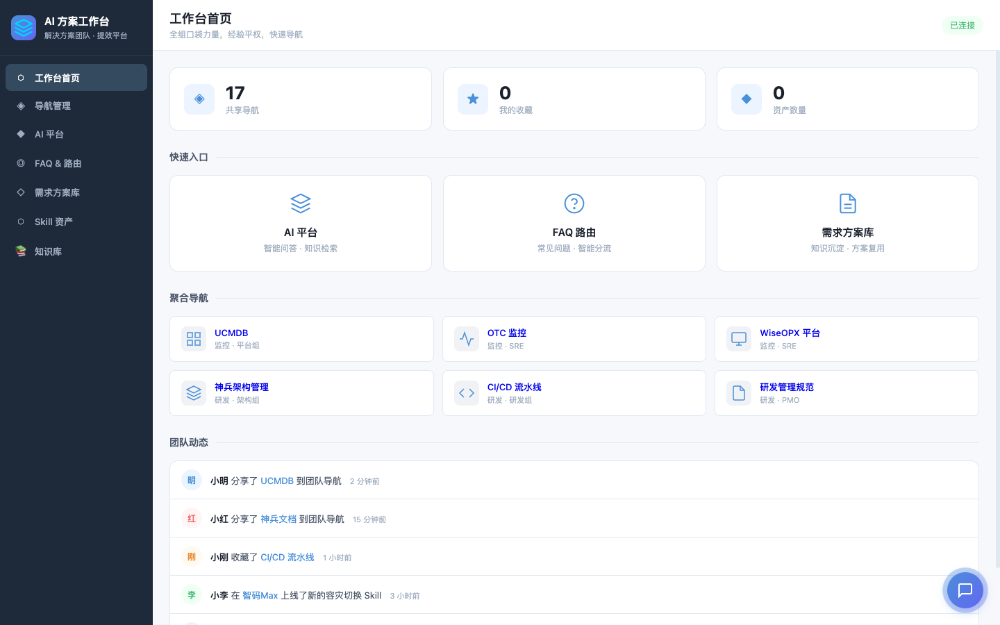
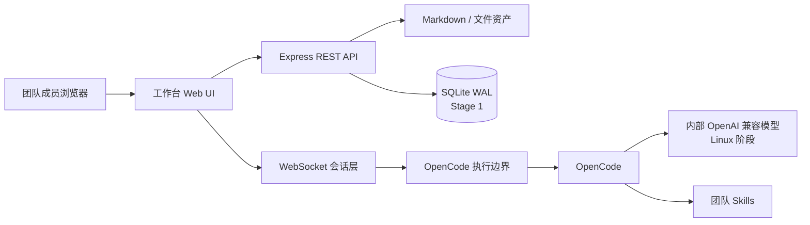
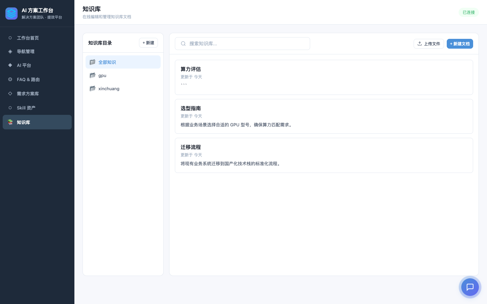

# OpenCode 团队 AI 工作台

面向 15–20 人内部团队的中心化 AI 工作台：成员通过浏览器使用 OpenCode、管理知识、沉淀方案，并逐步形成可校验、可发布、可回滚的团队 Skill 资产。

> 当前研发阶段：**Stage 0 已完成，Stage 1A 数据与账号基础已完成；尚未达到生产上线条件。** 登录 API、权限接入和前端登录仍在开发，不应把当前版本直接开放给真实多用户使用。

[查看完整路线图](docs/ROADMAP.md) · [查看验收报告](docs/dev-loop-runs/2026-09-01-stage-0-security-baseline/04-acceptance-report.md) · [查看架构设计](docs/superpowers/specs/2026-09-01-team-ai-workbench-design.md)



## 三分钟体验

无需 OpenCode、模型服务或 API Key，即可启动完整前后端 Demo：

```bash
git clone https://github.com/rainerzhao/opencode-ia.git
cd opencode-ia
npm ci
npm run demo
```

打开终端显示的地址，默认是 `http://127.0.0.1:4317`。

Demo 会：

- 启动真实 Express、REST API 和 WebSocket 前后端链路；
- 只监听本机回环地址 `127.0.0.1`，不会对局域网开放无认证服务；
- 展示三篇示例知识文档；
- 使用明确标注的“Demo 模拟回复”，不调用真实模型；
- 把所有可写数据放进系统临时目录；
- 按 `Ctrl+C` 后关闭服务并删除临时数据。

如需指定端口：

```bash
DEMO_PORT=4321 npm run demo
```

## 当前能看到什么

| 能力 | 当前状态 | 说明 |
| --- | --- | --- |
| 工作台前端 | ✅ 可演示 | 首页、AI 对话、知识库、方案、Skill、导航和 FAQ 页面 |
| OpenCode 调用边界 | ✅ 已加固 | 参数化执行、超时、取消、输出限制、错误脱敏 |
| 多会话控制 | ✅ 基线完成 | 全局会话上限、单会话串行、断线和关服取消 |
| 知识文件与上传 | ✅ 基线完成 | 路径、符号链接、上传暂存、失败回滚保护 |
| URL 导入 | ✅ 默认关闭 | 白名单、DNS 地址校验、逐跳重定向、超时和大小限制 |
| 用户名/密码 | 🚧 Stage 1A | 首位管理员 CLI 已完成；登录 API 在 Stage 1B |
| 角色与审计 | ⏳ Stage 1 | `admin/member`，操作绑定登录账号 |
| SQLite 数据层 | ✅ Stage 1A | WAL、版本化迁移、用户/Session/审计仓储 |
| 常驻 OpenCode Gateway | ⏳ Stage 2 | 当前仍是每条消息一次有界 `opencode run` |
| Skill 发布中心 | ⏳ Stage 4 | 校验、版本、安装、启用、回滚和归档 |
| Linux 生产部署 | ⏳ Stage 5 | 内部模型、备份、监控和 15–20 人容量验收 |

## 产品原则

- 所有模型推理、Agent、Skill 和工具执行必须经过 OpenCode；工作台不直连模型 API。
- 对话和个人产物默认私有，用户明确确认后才能发布为团队知识或解决方案。
- 普通成员可以开发 Skill；发布前必须经过自动校验，并保留版本、禁用和回滚能力。
- AI 辅助处理和生成，人负责判断、风险复核与最终交付。
- IP 只可用于网络层限制，不作为用户身份；审计身份来自账号登录。

## 架构概览



当前 Stage 0 使用静态前端 + 模块化 Express 后端。Stage 1 迁移 React/Vite 并加入账号和 SQLite；Stage 2 再把每消息进程模式替换为常驻 OpenCode Gateway。

## 真实模式：Mac 开发启动

### 要求

- macOS（当前开发和验收环境）
- Node.js 24.x（已验证：24.15.0）
- npm 11.x
- 已安装并能独立运行的 OpenCode

安装依赖：

```bash
npm ci
```

复制并检查环境变量：

```bash
cp .env.example .env
```

至少确认 `OPENCODE_CMD` 和 `OPENCODE_CWD`。项目不接收模型 API Key；Provider 地址和凭证只配置在 OpenCode 自己的受保护环境中。

```bash
set -a
. ./.env
set +a
npm start
```

默认打开 `http://127.0.0.1:3000`。

## 配置

| 变量 | 默认值 | 用途 |
| --- | --- | --- |
| `WORKBENCH_ROOT` | 项目目录 | 工作台文件根目录 |
| `PORT` | `3000` | HTTP/WebSocket 端口 |
| `MAX_SESSIONS` | `20` | WebSocket 全局会话上限 |
| `OPENCODE_CMD` | `$HOME/.opencode/bin/opencode` | OpenCode 可执行文件 |
| `OPENCODE_CWD` | 工作台根目录 | OpenCode 运行目录 |
| `OPENCODE_TIMEOUT_MS` | `120000` | 单次消息超时，单位毫秒 |
| `OPENCODE_MAX_OUTPUT_BYTES` | `10485760` | stdout 与 stderr 总字节上限 |
| `KNOWLEDGE_DIR` | `<root>/knowledge` | Markdown 知识目录 |
| `SOLUTIONS_DIR` | `<root>/solutions` | 方案目录 |
| `SKILLS_DIR` | `<root>/.opencode/skills` | Skill 展示目录 |
| `DATABASE_PATH` | `<root>/data/workbench.db` | SQLite 运行数据库；被 Git 忽略 |
| `UPLOAD_TEMP_DIR` | `<root>/data/tmp/uploads` | 上传暂存目录 |
| `KNOWLEDGE_FETCH_ALLOWED_HOSTS` | 空 | URL 导入精确主机白名单 |

URL 导入默认禁用。启用后不支持通配符，非默认端口必须写为 `host:port`；每次重定向都会重新校验，回环、链路本地、云元数据和未授权地址会被拒绝。

### Stage 1A：创建首位管理员

首次初始化使用本机交互式命令，不提供默认账号，也不接受密码命令参数：

```bash
npm run admin:create -- --username admin --display-name 管理员
```

密码会隐藏输入两次，并使用 `scrypt` 和独立随机盐保存。该命令只完成账号数据库初始化；浏览器登录将在 Stage 1B–1D 接通，当前 `npm run demo` 仍是隔离的无密钥演示模式。

## 验证与安全

```bash
npm test
npm run check
npm run security:scan
```

- 自动测试覆盖真实 HTTP/WebSocket、OpenCode 子进程、路径、上传和 URL 安全边界。
- 语法检查只检查仓库自有 JavaScript 文件。
- 密钥扫描只输出相对路径和规则名，不输出疑似密钥原文。
- `.env` 和本机运维交接文档被 Git 忽略；曾经暴露的 Provider Key 必须在 Provider 后台轮换。



## 项目目录

```text
public/       当前前端页面
src/          后端、OpenCode 执行和安全策略
knowledge/    示例 Markdown 知识
scripts/      Demo、语法检查和密钥扫描
test/         Node 自动测试
docs/         架构设计、路线图和验收证据
server.js     生产模式薄启动入口
```

## Linux 迁移边界

生产目标是公司内网单台 Linux 服务器。迁移时保持工作台与模型配置分离，由非 root 进程运行，使用 Nginx 提供 HTTPS、反向代理和可选内网网段限制。

在账号、权限、SQLite 审计、备份恢复、内部模型联调和并发验收完成前，本项目只能用于开发和演示，不能宣称已生产上线。

## 参与开发

开始修改前先阅读 [ROADMAP](docs/ROADMAP.md) 和 [架构设计](docs/superpowers/specs/2026-09-01-team-ai-workbench-design.md)。提交前必须执行三项验证，并确保没有把真实 API Key、`.env`、运行数据或日志加入 Git。
