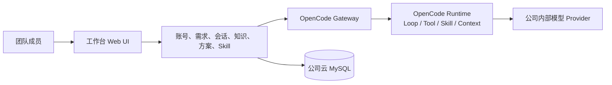

# OpenCode 团队 AI 工作台

> 面向集团各 BU 的云解决方案工作台：把日常沟通沉淀为可追溯的需求，把个人经验沉淀为默认私有、可复用的团队资产。

OpenCode 团队 AI 工作台面向不超过 20 人的内部解决方案团队。成员通过统一入口记录客户沟通、管理需求、持续与 AI 协作，并沉淀知识、方案和 Skill；管理员负责账号、统一字段和运行状态，而不是查看成员的私人正文。

## 项目状态

**当前处于“Mac 应用验收完成，内网预发布待验收”阶段。**

| 范围 | 状态 | 说明 |
| --- | --- | --- |
| 产品底座、常驻 Gateway、知识/方案、Skill 中心 | ✅ Mac 已验收 | 已完成账号权限、默认私有、多会话、资产沉淀和团队 Skill 生命周期闭环。 |
| 需求与场景工作台 | ✅ 本机 Demo 已验收 | 已支持 BU、统一字段、沟通记录、AI 草稿人工确认、资产关联和私有会话资料库；首页会安全汇总个人待推进事项与下一步。 |
| 20 用户调度 | ✅ 模拟路径已验收 | 已回归 20 登录用户、60 个持久会话、180 个多轮任务；这不是模型吞吐或生产 SLA。 |
| MySQL 单一数据层 | ✅ Mac 真库已验收 | 生产组合连接 MySQL；公司云 MySQL 网络、CA 与恢复演练仍待验证。 |
| 公司 Linux / 内部模型 / 生产开放 | 🚧 待预发布验收 | 尚未取得真实 Provider、Linux 隔离、20 用户真实模型压测和灾备证据。 |

**请勿将 Demo、模拟任务或 Mac 验收理解为已经在公司生产上线。** 生产开放前必须完成[公司内网预发布交接清单](docs/operations/company-preflight-handoff.md)。完整阶段、验收口径和已知边界见[产品路线图](docs/ROADMAP.md)。

## OpenCode 在这里做什么

OpenCode 是唯一的 Agent Runtime：它连接公司内部的 OpenAI 兼容模型，执行 Agent Loop、工具与 Skill。本项目不另造 Agent、不让前端直连模型，而是在 OpenCode 之上补齐团队使用所需的账号、权限、持久会话、资产治理、审计与运行管理。



这意味着账号、Conversation、OpenCode Session、Runtime 和执行槽位是相互独立的：一个人可以拥有多个长期会话；多个会话由常驻 Runtime 与公平队列承载；模型服务的并发限制则是另一层需要在公司环境实测的约束。

## 为什么需要它

- **把沟通落下来：** 手工记录 IIM、电话、会议和导入资料，形成有负责人、BU 与状态的需求。
- **把 AI 协作留得住：** 私有 Conversation 可生成结构化草稿，必须经用户核对、修改和确认后才创建需求。
- **把经验变成资产：** 对话可沉淀为方案和知识；成员可开发、校验、发布、安装、升级或回滚 Skill。
- **让团队可控地共享：** 内容默认私有，显式确认后才共享；管理员管理账号和运行，不默认获得成员私人正文。
- **让上线有边界：** 生产数据使用外部云 MySQL，模型调用统一经 OpenCode，密钥不进入前端、仓库、数据库或日志。

## 当前可体验的能力

| 工作区 | 成员可以做什么 |
| --- | --- |
| 我的工作台 | 查看仅属于自己的待推进需求、待澄清事项、进行中会话与待沉淀内容，并一键进入对应工作区。 |
| 需求与场景 | 新建、筛选、编辑默认私有需求；记录沟通；关联自己的会话、知识和方案。 |
| AI 对话 | 创建多个私有 Conversation，搜索、分页、归档、恢复，并查看排队、运行和中断状态。 |
| 知识与方案 | 上传和编辑个人资料；查看版本、来源、附件、差异与历史恢复；将确认的对话沉淀为方案。 |
| 团队 Skill 中心 | 以私有草稿开发 Skill，校验后人工发布；成员独立安装、启用、升级或回滚。 |
| 管理 | 管理员创建/停用账号、重置密码、维护 BU 与统一字段、撤销登录会话、查看脱敏运行概况。 |


## 三分钟体验

无需配置 OpenCode、模型服务或 API Key，即可启动隔离的无密钥 Demo：

```bash
git clone https://github.com/rainerzhao/opencode-ia.git
cd opencode-ia
npm ci
npm run demo
```

打开终端显示的地址（默认 `http://127.0.0.1:4317`），使用终端临时生成的 `demo-admin` 凭证登录。Demo 使用明确标注的模拟回复，不调用真实模型；数据仅保留在本次临时目录，关闭后会清理。

Demo 适合产品评审和流程体验，包含登录、账号管理、需求与沟通、知识、方案、私有多会话、Skill 生命周期等页面；不适合证明公司模型质量、生产并发或安全合规。

## 生产部署路线

生产目标是公司内网的一台 Linux 服务，不在应用 Compose 中自建 MySQL：

1. 公司提供非 root 服务账号、HTTPS/Nginx、外部 MySQL 8.4 与内部 CA。
2. 将公司内部 OpenAI 兼容模型配置在 OpenCode 受保护的运行环境中。
3. 应用使用 `WORKBENCH_DATABASE_URL` 连接公司云 MySQL，并通过启动门禁后才监听端口。
4. 在预发布机完成真实多会话、20 用户、取消/断线、Runtime/MySQL 故障、备份恢复与回滚演练。
5. 由人工确认残余风险后，再开放内网访问。

部署命令、环境变量和模板见[内网部署手册](docs/operations/intranet-deployment.md)。公司交接时请按[预发布交接清单](docs/operations/company-preflight-handoff.md)逐项留存证据，并按[内部 Provider 联调清单](docs/operations/internal-provider.md)完成真实模型验证。

在启动服务前，可运行 `npm run preflight:release` 生成一份脱敏 JSON 就绪报告：它同时执行生产配置与 OpenCode Provider 两项门禁，任一失败即返回非零退出码。该报告只证明本机配置是否满足静态门槛，不检查公司网络、MySQL、模型能力或 Linux 运行结果。

## 产品原则

- OpenCode 是唯一 Agent Runtime；工作台不直接调用模型 Provider。
- 用户身份来自用户名/密码登录，不以办公电脑 IP 作为身份。
- Conversation、知识、方案和 Skill 草稿默认私有；共享必须由人明确确认。
- 账号、Conversation、OpenCode Session、Runtime 与执行槽位分层治理，不将会话数误当成并发推理数。
- AI 负责辅助生成，人负责事实核对、风险复核和最终交付。

## 文档导航

| 想了解什么 | 文档 |
| --- | --- |
| 产品目标、阶段出口与验收边界 | [产品目标](docs/PRODUCT_GOAL.md) · [研发路线图](docs/ROADMAP.md) |
| Runtime、会话与数据库分工 | [数据层与 Agent Runtime 架构](docs/architecture/data-and-runtime-architecture.md) · [Gateway 设计](docs/architecture/stage-2-opencode-gateway.md) |
| 公司内网部署与真实模型联调 | [内网部署手册](docs/operations/intranet-deployment.md) · [预发布交接清单](docs/operations/company-preflight-handoff.md) · [Provider 联调清单](docs/operations/internal-provider.md) |
| 需求与场景产品方向 | [当前产品目标](docs/PRODUCT_GOAL.md) |

## 开发与验证

本机真实模式需要可独立运行的 OpenCode；Provider 凭证仅配置在 OpenCode 的受保护环境中。开发前复制 `.env.example` 为 `.env`，按部署文档配置运行路径后执行：

```bash
npm ci
npm start
```

提交前运行：

```bash
npm test
npm run build
npm run check
npm run security:scan
```

真实 OpenCode、生产配置和真实 20 用户验收均为显式选择的环境测试，详见[路线图](docs/ROADMAP.md)和[预发布交接清单](docs/operations/company-preflight-handoff.md)。

## 贡献与安全

欢迎以 Issue 或 Pull Request 讨论改进。提交前请勿写入模型密钥、Cookie、真实 Prompt/响应、公司域名、用户名或生产数据库连接串；仓库的密钥扫描和安全检查是最低门槛，不能替代公司安全审查。

本仓库当前提供的是可验证的研发成果与预发布交付基础，不提供生产 SLA 或内部模型服务保证。
