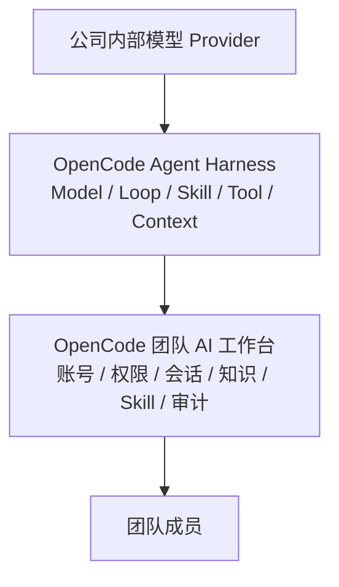
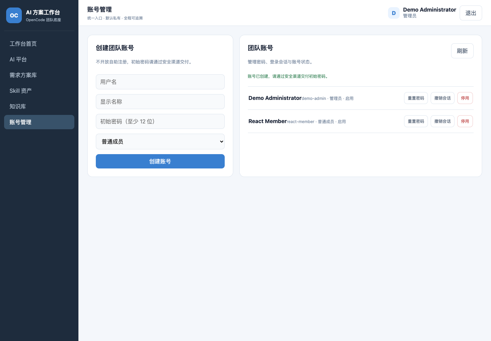
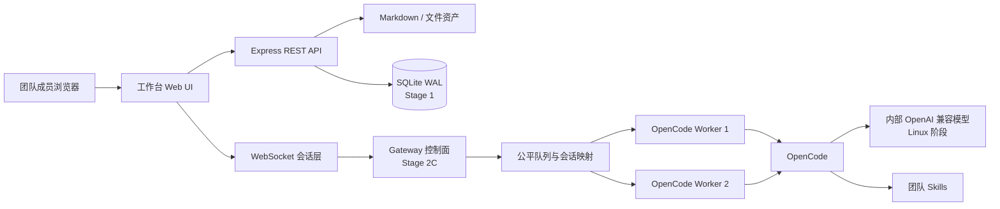

# OpenCode 团队 AI 工作台

> 让团队通过一个入口使用 AI，把一次次个人实践沉淀为可复用的团队能力。

OpenCode 团队 AI 工作台是一套面向内部团队的 AI 协作平台。成员无需各自配置模型、密钥和运行环境，通过浏览器登录后，就能使用统一的 AI 能力处理工作、管理个人知识、沉淀解决方案，并逐步共建团队 Skill 资产。

## 它在 Agent 世界中的位置

理解这个项目，可以先用一句话建立共同认知：**Agent = Model + Harness**。模型提供理解和生成能力，Harness 负责把模型接入上下文、工具、Skill 和持续运行的 Agent Loop，让 AI 能够真正执行任务。

在这个体系中，**OpenCode 是 Agent 执行引擎**：它连接公司内部模型，负责 Agent、Loop、Skill 和工具的实际运行；**本项目是建立在 OpenCode 之上的团队工作台**：它提供团队统一入口，并补齐多人使用所需的账号、权限、会话、知识、审计和资产治理能力。



因此，工作台不是另一个 Agent，也不替代 OpenCode。它解决的是如何把面向个人的 Agent 执行能力，建设成一个可供团队长期、集中、安全使用的内部 AI 工作平台。

## 它解决什么问题

- **统一使用入口：** 团队成员不再分别维护模型配置、工具链和本地环境。
- **保护个人空间：** 对话、知识和方案默认归属于创建者，不会自动变成团队公开内容。
- **沉淀工作成果：** 有价值的对话可以经过人工确认，继续整理为方案、知识和 Skill。
- **建立管理边界：** 账号、角色和操作记录统一管理，明确每一次操作由谁发起。
- **复用团队能力：** 让个人经验逐步变成所有成员都能找到、安装和使用的团队资产。

## 当前可以体验

- 使用管理员分配的用户名和密码登录；
- 通过统一入口与 OpenCode 对话；
- 搜索、新建、编辑和上传个人知识；
- 将确认过的对话保存为个人方案；
- 由管理员创建账号、重置密码、停用账号和撤销登录会话；
- 在没有真实模型和密钥的情况下运行完整 Demo。

> 当前版本用于产品体验和持续研发，尚未开放为公司内网生产服务。Stage 2C 已完成双 Worker、会话粘性、公平排队和故障隔离底座；浏览器多会话接入、完整团队 Skill 发布和 Linux 部署仍会在后续版本逐步完成。

[查看产品路线图](docs/ROADMAP.md) · [查看整体设计](docs/superpowers/specs/2026-09-01-team-ai-workbench-design.md) · [查看 Gateway 设计](docs/architecture/stage-2-opencode-gateway.md)



## 三分钟体验

无需 OpenCode、模型服务或 API Key，即可启动完整前后端 Demo：

```bash
git clone https://github.com/rainerzhao/opencode-ia.git
cd opencode-ia
npm ci
npm run demo
```

打开终端显示的地址，默认是 `http://127.0.0.1:4317`。脚本会为本次临时环境生成随机密码的 `demo-admin`，账号和密码只输出到当前终端。用该账号登录后，可以体验完整工作台、账号管理和受认证保护的 REST/WebSocket 链路。

Demo 包含：

- 完整的登录、退出和账号管理体验；
- 知识搜索、新建、编辑和上传体验；
- AI 对话与“沉淀为方案”体验；
- 展示三篇示例知识文档；
- 使用明确标注的“Demo 模拟回复”，不调用真实模型；
- 所有数据只用于本次体验，关闭 Demo 后自动清理。

如需指定端口：

```bash
DEMO_PORT=4321 npm run demo
```

## 产品能力一览

| 产品能力 | 状态 | 用户可以做什么 |
| --- | --- | --- |
| AI 工作台 | ✅ 可体验 | 登录后使用对话、知识、方案和 Skill 入口 |
| 个人知识 | ✅ 可体验 | 搜索、新建、编辑和上传知识文件 |
| 个人方案 | ✅ 可体验 | 将人工确认过的对话沉淀为私有方案 |
| 账号与角色 | ✅ 可体验 | 管理员管理账号，普通成员只使用业务功能 |
| 数据与操作边界 | ✅ 已具备 | 个人内容默认私有，关键操作保留账号归属 |
| 多用户实时对话 | ✅ 基础版可体验 | 支持身份隔离和同时在线，断线后不保留运行会话 |
| 常驻多会话 Gateway | 🚧 2C 已完成 | 已具备双 Worker、会话粘性、公平排队和故障隔离；产品聊天接入继续开发 |
| Skill 资产浏览 | ✅ 基础版可体验 | 展示服务器中已经安装的 Skill |
| 团队 Skill 中心 | 📝 待开发 | 成员创建、校验、发布、安装、启用、版本和回滚 Skill |
| 内网生产服务 | 📝 规划中 | 部署到 Linux，并接入公司内部模型服务 |

## 产品原则

- 所有模型推理、Agent、Skill 和工具执行必须经过 OpenCode；工作台不直连模型 API。
- 对话和个人产物默认私有，用户明确确认后才能发布为团队知识或解决方案。
- 普通成员可以开发 Skill；发布前必须经过自动校验，并保留版本、禁用和回滚能力。
- AI 辅助处理和生成，人负责判断、风险复核与最终交付。
- IP 只可用于网络层限制，不作为用户身份；审计身份来自账号登录。

## 架构概览



当前使用 React/Vite 前端 + 模块化 Express 后端，账号、SQLite、私有知识和方案底座已经接通。Stage 2A 建立持久状态，Stage 2B 验证受保护的常驻 OpenCode 进程与 HTTP/SSE 协议，Stage 2C 已把它们组合为默认双 Worker 的调度底座：同一 Conversation 串行、不同用户可并行、单用户不能占满系统，单个 Worker 异常只中断其承载的任务。产品聊天要到 Stage 2D 才切换到这条链路。

## 真实模式：Mac 开发启动

### 要求

- macOS（当前开发和验收环境）
- Node.js 24.x（已验证：24.15.0）
- npm 11.x
- 已安装并能独立运行的 OpenCode

安装依赖：

```bash
npm ci
```

复制并检查环境变量：

```bash
cp .env.example .env
```

至少确认 `OPENCODE_CMD` 和 `OPENCODE_CWD`。项目不接收模型 API Key；Provider 地址和凭证只配置在 OpenCode 自己的受保护环境中。

```bash
set -a
. ./.env
set +a
npm start
```

默认打开 `http://127.0.0.1:3000`。

## 配置

| 变量 | 默认值 | 用途 |
| --- | --- | --- |
| `WORKBENCH_ROOT` | 项目目录 | 工作台文件根目录 |
| `PORT` | `3000` | HTTP/WebSocket 端口 |
| `MAX_SESSIONS` | `20` | WebSocket 全局会话上限 |
| `OPENCODE_CMD` | `$HOME/.opencode/bin/opencode` | OpenCode 可执行文件 |
| `OPENCODE_CWD` | 工作台根目录 | OpenCode 运行目录 |
| `OPENCODE_TIMEOUT_MS` | `120000` | 单次消息超时，单位毫秒 |
| `OPENCODE_MAX_OUTPUT_BYTES` | `10485760` | stdout 与 stderr 总字节上限 |
| `OPENCODE_WORKER_BASE_PORT` | `4319` | 常驻 Worker 起始回环端口 |
| `OPENCODE_WORKER_COUNT` | `2` | Mac 默认常驻 Worker 数 |
| `OPENCODE_WORKER_HEARTBEAT_MS` | `5000` | Worker 心跳间隔 |
| `OPENCODE_WORKER_HEARTBEAT_TIMEOUT_MS` | `2000` | 单次心跳等待上限 |
| `OPENCODE_WORKER_STARTUP_TIMEOUT_MS` | `10000` | Worker 启动健康等待上限 |
| `OPENCODE_WORKER_READINESS_INTERVAL_MS` | `100` | Worker 启动阶段健康检查间隔 |
| `OPENCODE_WORKER_STOP_GRACE_MS` | `2000` | Worker 优雅停止等待时间 |
| `OPENCODE_WORKER_KILL_GRACE_MS` | `1000` | 强制停止后的最终等待时间 |
| `OPENCODE_WORKER_USERNAME` | `opencode` | 仅供回环 Worker 使用的 Basic Auth 用户名 |
| `OPENCODE_VERIFIED_VERSION` | `1.18.25` | 当前完成协议验证的 OpenCode 版本 |
| `GATEWAY_GLOBAL_RUNNING` | `2` | 全局同时运行任务上限 |
| `GATEWAY_USER_RUNNING` | `1` | 单用户同时运行任务上限 |
| `GATEWAY_USER_QUEUED` | `3` | 单用户排队任务上限 |
| `GATEWAY_WORKSPACE_ROOT` | `<root>/data/workspaces` | 服务端生成的 Conversation 工作目录根 |
| `KNOWLEDGE_DIR` | `<root>/knowledge` | Markdown 知识目录 |
| `SOLUTIONS_DIR` | `<root>/solutions` | 方案目录 |
| `SKILLS_DIR` | `<root>/.opencode/skills` | Skill 展示目录 |
| `DATABASE_PATH` | `<root>/data/workbench.db` | SQLite 运行数据库；被 Git 忽略 |
| `UPLOAD_TEMP_DIR` | `<root>/data/tmp/uploads` | 上传暂存目录 |
| `COOKIE_SECURE` | 生产环境为 `true` | HTTPS 下为认证 Cookie 增加 `Secure` |
| `SESSION_TTL_SECONDS` | `28800` | 登录 Session 有效期，单位秒 |
| `LOGIN_MAX_FAILURES` | `5` | 登录窗口内最大失败次数 |
| `LOGIN_WINDOW_SECONDS` | `900` | 登录失败统计窗口，单位秒 |
| `LOGIN_LOCK_SECONDS` | `900` | 触发限速后的锁定时长，单位秒 |
| `KNOWLEDGE_FETCH_ALLOWED_HOSTS` | 空 | URL 导入精确主机白名单 |

URL 导入默认禁用。启用后不支持通配符，非默认端口必须写为 `host:port`；每次重定向都会重新校验，回环、链路本地、云元数据和未授权地址会被拒绝。

### Stage 1A：创建首位管理员

首次初始化使用本机交互式命令，不提供默认账号，也不接受密码命令参数：

```bash
npm run admin:create -- --username admin --display-name 管理员
```

密码会隐藏输入两次，并使用 `scrypt` 和独立随机盐保存。

### Stage 1B–1E：认证、业务权限与 React 浏览器体验

当前已提供并接入前端的能力：

- `POST /api/auth/login`、`POST /api/auth/logout`、`GET /api/auth/me`；
- `POST /api/auth/change-password`；
- `GET/POST /api/admin/users`；
- 管理员密码重置、账号启停和 Session 强制撤销接口。
- 所有业务 REST 和 WebSocket 强制登录，业务写请求强制 CSRF；
- 方案和知识草稿按登录用户默认私有，成员之间不可互读；
- WebSocket 绑定 `userId`、角色和登录 Session，执行前重新验证撤销状态；
- 关键知识、方案和 OpenCode 执行动作写入脱敏审计。
- 浏览器启动先调用 `/api/auth/me`，未登录跳转到独立登录页；不在 `localStorage`、`sessionStorage` 或 JavaScript 中保存 Session Token；
- 所有业务请求统一经过认证客户端，写请求自动携带服务端签发的 CSRF 值；
- 管理员页面支持建号、遮蔽输入的密码重置、账号启停和 Session 撤销；普通成员看不到管理入口；
- 知识页面支持搜索、新建 Markdown、查看/编辑和安全上传；私人知识按账号隔离；
- AI 对话通过认证 WebSocket 接入 OpenCode，用户明确点击后才能把对话沉淀为私人方案；
- 需求方案从浏览器本地存储迁移到服务端私有方案目录。

Session 使用高熵不透明 Cookie，数据库只保存 SHA-256 摘要；写操作同时校验 Session Cookie、可读 CSRF Cookie、`X-CSRF-Token` 请求头与数据库摘要。`npm run demo` 使用隔离临时目录、随机临时账号和本地模拟 OpenCode，不调用真实模型或密钥。

## 验证与安全

```bash
npm test
npm run check
npm run security:scan
```

- 自动测试覆盖真实 HTTP/WebSocket、OpenCode 子进程、Gateway 持久状态、常驻 Worker、双 Worker 调度、公平队列、20 用户模拟、路径、上传、URL 安全边界及 React 前端契约；Stage 2C 当前共 166 项（提交前以最新全量输出为准）。
- 语法检查只检查仓库自有 JavaScript 文件。
- 密钥扫描只输出相对路径和规则名，不输出疑似密钥原文。
- `.env` 和本机运维交接文档被 Git 忽略；曾经暴露的 Provider Key 必须在 Provider 后台轮换。


## 已知限制与下一阶段

- Stage 1E 已完成 React/Vite 迁移；当前没有完整客户端路由和设计系统，后续按功能增长再引入，避免为首版过度设计。
- 当前产品聊天仍调用一次有界 `opencode run`；Stage 2C 的双 Worker Gateway 调度底座已经完成，但要到 Stage 2D 才会通过 Conversation API、可续传 WebSocket 和新前端体验替换旧聊天链路。
- 当前知识与方案使用文件系统作为 Stage 1 过渡层，尚未具备审核发布、版本和回滚闭环。
- 前端资源已全部本地打包，不依赖公共 CDN；真实 OpenCode 与内部模型尚未联调。
- 当前完成的是 Mac 开发验收，不代表公司内网 Linux 已达到生产标准。

下一交付点是 **Stage 2D：Conversation API、可续传 WebSocket 和前端多会话体验**。它会把已经验证的双 Worker 调度底座真正接入成员可见的产品聊天，同时保留现有账号、默认私有和审计边界。完整决策与验收标准见 [Stage 2 Gateway 架构](docs/architecture/stage-2-opencode-gateway.md)。

## 项目目录

```text
apps/web/     React/Vite 前端
apps/server/  生产服务组合入口
packages/     前后端共享契约
src/          后端、OpenCode 执行和安全策略
knowledge/    示例 Markdown 知识
scripts/      Demo、语法检查和密钥扫描
test/         Node 自动测试
docs/         架构设计、路线图和验收证据
server.js     兼容的生产模式薄启动入口
```

## Linux 迁移边界

生产目标是公司内网单台 Linux 服务器。迁移时保持工作台与模型配置分离，由非 root 进程运行，使用 Nginx 提供 HTTPS、反向代理和可选内网网段限制。

在账号、权限、SQLite 审计、备份恢复、内部模型联调和并发验收完成前，本项目只能用于开发和演示，不能宣称已生产上线。

## 参与开发

开始修改前先阅读 [ROADMAP](docs/ROADMAP.md) 和 [架构设计](docs/superpowers/specs/2026-09-01-team-ai-workbench-design.md)。提交前必须执行三项验证，并确保没有把真实 API Key、`.env`、运行数据或日志加入 Git。
