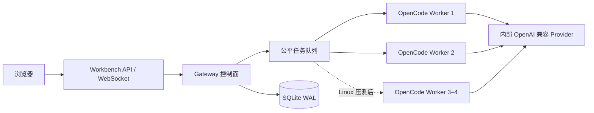

# Stage 2：常驻 OpenCode Gateway 与多 Worker 会话架构

**状态：** 设计确认；Stage 2A 已完成，Stage 2B–2E 待开发
**目标环境：** Mac 开发验收，随后迁移公司内网单台 Linux  
**目标规模：** 15–20 名成员

## 结论

Stage 2 采用“一个常驻 Gateway 控制面 + 多个常驻 OpenCode Worker 执行面 + 多个逻辑会话”的单机架构。

不采用“每个用户固定一个进程”，也不继续“每条消息冷启动一个进程”。用户数量、会话数量与 Worker 数量相互独立：一个人可以有多个 Conversation；一个 Worker 可以承载多个 OpenCode Session；同一个 Session 在任意时刻只运行一个任务。

Mac 首版默认启动 2 个 Worker。Linux 上先保持 2 个，根据真实压测再调整到 2–4 个。第一版使用 SQLite 持久化任务与映射，不引入 Redis、Kubernetes 或跨主机调度。

## 为什么需要常驻、多 Worker、多会话

- **常驻：** 避免每条消息重复启动 OpenCode、加载配置和发现 Skill，降低首字延迟。
- **多会话：** 保存每段对话自己的上下文、工作目录和 OpenCode Session，支持连续对话与恢复。
- **多 Worker：** 单个执行进程异常或长任务不会阻塞全体成员，并能提供有限、可控的并行度。
- **不按用户固定 Worker：** 15–20 人并不等于需要 15–20 个常驻进程；固定绑定会造成空闲浪费和热点用户拥塞。

## 组件边界



Gateway 负责：

- Conversation、OpenCode Session 与 Worker 的映射；
- 排队、全局并发、单用户并发、超时与取消；
- 将 OpenCode 的流式事件转换为稳定的工作台事件；
- Worker 健康检查、熔断、重启和会话恢复；
- 任务状态、恢复信息与安全审计。

Worker 负责：

- 托管常驻 OpenCode 运行时；
- 执行模型、Agent、Skill 和工具调用；
- 隔离每个 Session 的工作目录和上下文；
- 向 Gateway 报告心跳、执行事件和结束状态。

工作台仍不接触 Provider API Key。Provider 地址和密钥只存在于 OpenCode Worker 的受保护运行环境。

## 会话与任务模型

粘性映射为：

```text
workbench conversation_id -> opencode_session_id -> worker_id
```

建议的最小持久化对象：

- `conversations`：所有者、标题、状态、默认模型；
- `opencode_sessions`：Conversation 映射、Worker、工作目录、恢复状态；
- `gateway_jobs`：排队、运行、完成、失败、取消状态和幂等键；
- `gateway_workers`：进程实例、心跳、容量、版本和健康状态；
- `gateway_events`：可恢复的事件序号与必要元数据，正文按既定隐私策略保存。

一个 Conversation 可以连续提交多个 Job，但同一 Session 必须串行。不同 Session 可以并行。前端重连时携带最后收到的事件序号，由 Gateway 补发缺失事件或返回当前快照。

## 调度与容量默认值

首版建议：

| 项目 | Mac 默认 | Linux 初始 | 说明 |
| --- | ---: | ---: | --- |
| Worker 数 | 2 | 2 | 压测后最多先扩至 4 |
| 全局运行任务 | 2 | 2 | 不应超过健康 Worker 可用槽位 |
| 单用户运行任务 | 1 | 1 | 防止单个用户占满系统 |
| 单用户排队任务 | 3 | 3 | 超限明确拒绝，不无限堆积 |
| 单 Session 并发 | 1 | 1 | 保证上下文和工具副作用顺序 |

队列按用户做轮转公平调度，在同一用户内部按创建时间排序。管理员可以看到任务元数据并取消异常任务，但默认不能查看私人对话正文。

## 故障与恢复

- Worker 心跳超时后停止分配新任务，当前任务标记为 `interrupted`。
- Gateway 重启后从 SQLite 恢复队列；`running` 任务不能直接假定成功，必须向原 Worker/OpenCode 查询或转为可重试状态。
- 有副作用的工具任务默认不自动重放；只读生成任务可由用户确认后重试。
- Worker 重启优先使用原 `opencode_session_id` 恢复；不可恢复时创建新 Session，并在 UI 明确提示上下文恢复边界。
- Gateway 退出时先停止接收新任务，再等待短时排空，超时后取消并持久化剩余状态。

## 安全与隔离

- Gateway 和 Worker 只监听回环地址或 Unix Socket；浏览器不能直连 Worker。
- 每个 Session 使用独立工作目录，目录权限绑定服务账号，禁止任意宿主机路径。
- 共享知识和已发布 Skill 以只读方式挂载；正式变更必须走工作台 API。
- Gateway 日志只记录用户、会话、任务、耗时、状态和安全元数据，不记录密码、Cookie、Token、API Key 或默认完整正文。
- 取消、重试、恢复、模型切换和 Worker 故障都写入审计。

## Stage 2 实施顺序

1. ✅ 定义 Gateway 接口、事件协议、状态机和 SQLite 迁移。
2. 接入单个常驻 OpenCode Worker，完成真实 Session 创建、发送、停止和恢复。
3. 增加 Worker 池、粘性映射和健康检查。
4. 增加公平队列、全局/单用户限流和幂等提交。
5. 完成 WebSocket 断线续传、Gateway/Worker 重启恢复和故障演练。
6. 在 Mac 使用真实 OpenCode 压测 2 Worker，再把相同架构迁移到 Linux 验证 2–4 Worker。

## 验收标准

- 两名及以上用户可在不同 Session 并行执行，同一 Session 不会并发写入；
- Worker 异常不会拖垮 Gateway，其他健康 Worker 能继续接单；
- Gateway 重启后队列和会话映射不丢失，任务状态不被误报；
- 取消、超时、断线重连与事件补发可重复验证；
- 单用户无法占满所有并发槽位；
- 工作台代码、数据库、前端和日志中均不存在 Provider 密钥；
- Mac 验收通过后，Linux 只需替换 OpenCode Provider/进程配置，不改业务协议。
