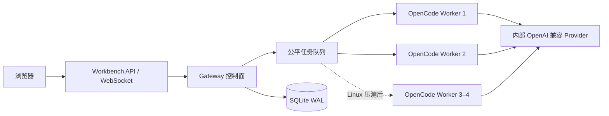

# Stage 2：常驻 OpenCode Gateway 与多 Worker 会话架构

**状态：** Stage 2A–2D 已完成；Stage 2E 的启动恢复、运维页面、Runtime 多 Session 真实验收和真实进程故障演练已完成；工具、文件与产物隔离待完成
**目标环境：** Mac 开发验收，随后迁移公司内网单台 Linux  
**目标规模：** 15–20 名成员

## 结论

### 2026-09-07 产品要求修正（优先于下方首版容量参数）

#### 2026-09-08 已验证增量

- `OPENCODE_WORKER_CAPACITY` 将 Runtime 进程数与单 Runtime 并发 Session 数分开；同 Conversation 保持串行。默认容量暂保留 1，部署需按真实服务额度设置全局和每用户配额，不把 Mac 短压测当作 Linux 容量结论。
- OpenCode 1.18.25、当前配置模型：单 Runtime、15 执行槽、5 账号、每人 3 会话，3 轮 45/45 成功；峰值 15 个运行任务、每用户 3 个；每轮耗时 19257/3265/2551 ms。后两轮未重复提供随机方案标识，回复仍保留本会话标识；检查其他会话标识不存在、跨账号 REST 读取返回 404。
- 真实命令：`WORKBENCH_REAL_ACCEPTANCE=1 WORKBENCH_MULTI_SESSION_ACCEPTANCE=1 node --test test/integration/five-users-multiround.test.js`。使用合成知识库方案、临时工作目录和 `permission: deny`。该验收不覆盖工具执行沙箱，也不是长期吞吐 SLA。
- 修复健康检查 1 秒超时误用于 Session 创建和模型请求；现在普通请求 10 秒、健康探针 1 秒、Prompt 使用独立任务期限。HTTP 200 响应中的模型错误不再视作成功空回复。
- 生产连续 3 次健康检查失败才将 Runtime 判为故障；恢复前停止旧进程，健康恢复后自动唤醒排队会话。未知执行结果不自动重放。
- 真实崩溃命令：`npm run test:runtime-crash`。验收主动 SIGKILL 自己启动的 Runtime，确认运行任务转为 interrupted、Runtime 以新 PID 自动恢复、原 OpenCode Session 校验成功后排队任务继续且上下文标识保留。本次属于单次 Mac 故障演练，不代表长期稳定性。
- 完整文件、工具与产物隔离仍待独立验收；该门禁完成前 Stage 2E 不宣告完成。

账号、持久 Conversation 和 Runtime 是独立维度。少量常驻 OpenCode Runtime 应能承载多个用户的多个 Session；不把一个 Session 等同于一个进程，也不把每个 Runtime 只能执行一个任务作为最终架构。需要先验证 OpenCode 1.18.25 同 Runtime 多 Session 并发，再配置每 Runtime 执行槽、全局配额与每用户配额。一个 Conversation 内保持串行，不同 Conversation 可并发。会话映射独立不代表工具沙箱：必须另行验证文件、权限和产物隔离，未验证前不宣称完整安全隔离。

产品验收使用 5 个真实登录账号，每人 3 个私人 Conversation，完成 3 轮方案讨论，检查跨轮上下文、串话、越权读取、运行与排队状态。`test/integration/five-users-multiround.test.js` 默认使用模拟模型，显式开启真实模式才调用当前 OpenCode 模型；真实 5×3×3 已完成。对 Codex、WorkBuddy 仅参考用户体验与可靠性要求，不假定其未公开内部实现。

后续顺序：完成工具、文件与产物隔离门禁 → Stage 4 团队 Skill 中心 → Stage 5 Linux 生产化。

Stage 2 采用“一个常驻 Gateway 控制面 + 多个常驻 OpenCode Worker 执行面 + 多个逻辑会话”的单机架构。

不采用“每个用户固定一个进程”，也不继续“每条消息冷启动一个进程”。用户数量、会话数量与 Worker 数量相互独立：一个人可以有多个 Conversation；一个 Worker 可以承载多个 OpenCode Session；同一个 Session 在任意时刻只运行一个任务。

Mac 首版默认启动 2 个 Worker。Linux 上先保持 2 个，根据真实压测再调整到 2–4 个。第一版使用 SQLite 持久化任务与映射，不引入 Redis、Kubernetes 或跨主机调度。

## 为什么需要常驻、多 Worker、多会话

- **常驻：** 避免每条消息重复启动 OpenCode、加载配置和发现 Skill，降低首字延迟。
- **多会话：** 保存每段对话自己的上下文、工作目录和 OpenCode Session，支持连续对话与恢复。
- **多 Worker：** 单个执行进程异常或长任务不会阻塞全体成员，并能提供有限、可控的并行度。
- **不按用户固定 Worker：** 15–20 人并不等于需要 15–20 个常驻进程；固定绑定会造成空闲浪费和热点用户拥塞。

## 组件边界



Gateway 负责：

- Conversation、OpenCode Session 与 Worker 的映射；
- 排队、全局并发、单用户并发、超时与取消；
- 将 OpenCode 的流式事件转换为稳定的工作台事件；
- Worker 健康检查、熔断、重启和会话恢复；
- 任务状态、恢复信息与安全审计。

Worker 负责：

- 托管常驻 OpenCode 运行时；
- 执行模型、Agent、Skill 和工具调用；
- 隔离每个 Session 的工作目录和上下文；
- 向 Gateway 报告心跳、执行事件和结束状态。

工作台仍不接触 Provider API Key。Provider 地址和密钥只存在于 OpenCode Worker 的受保护运行环境。

## 会话与任务模型

粘性映射为：

```text
workbench conversation_id -> opencode_session_id -> worker_id
```

建议的最小持久化对象：

- `conversations`：所有者、标题、状态、默认模型；
- `opencode_sessions`：Conversation 映射、Worker、工作目录、恢复状态；
- `gateway_jobs`：排队、运行、完成、失败、取消状态和幂等键；
- `gateway_workers`：进程实例、心跳、容量、版本和健康状态；
- `gateway_events`：可恢复的事件序号与必要元数据，正文按既定隐私策略保存。

一个 Conversation 可以连续提交多个 Job，但同一 Session 必须串行。不同 Session 可以并行。前端重连时携带最后收到的事件序号，由 Gateway 补发缺失事件或返回当前快照。

## 调度与容量默认值

首版建议：

| 项目 | Mac 默认 | Linux 初始 | 说明 |
| --- | ---: | ---: | --- |
| Worker 数 | 2 | 2 | 压测后最多先扩至 4 |
| 全局运行任务 | 2 | 2 | 不应超过健康 Worker 可用槽位 |
| 单用户运行任务 | 1 | 1 | 防止单个用户占满系统 |
| 单用户排队任务 | 3 | 3 | 超限明确拒绝，不无限堆积 |
| 单 Session 并发 | 1 | 1 | 保证上下文和工具副作用顺序 |

队列按用户做轮转公平调度，在同一用户内部按创建时间排序。管理员可以看到任务元数据并取消异常任务，但默认不能查看私人对话正文。

## 故障与恢复

- 运行期 Runtime 变为不健康时，其 active Session 先统一转为 recovering。进程恢复健康后逐个校验原 Session；校验完成前，相关 Conversation 不会被调度到新 Session。
- 原 Session 可用时恢复 active 并自动唤醒排队任务；原 Session 丢失时写入恢复边界、将依赖它的排队任务转为 interrupted，成员确认后才能重新发送。
- Runtime 恢复使用同步登记的互斥守卫，避免租用恢复槽位时状态回调重入、误判 Session 丢失。
- 真实进程验收会在首轮上下文建立后强制终止 Runtime，并在运行任务和排队任务同时存在时观察恢复；恢复分支必须保留原 Session 和上下文，丢失分支必须中断排队任务，两者之外均失败。

- Worker 心跳超时后停止分配新任务，当前任务标记为 `interrupted`。
- Gateway 重启后从 SQLite 恢复队列；`running` 任务不能直接假定成功，必须向原 Worker/OpenCode 查询或转为可重试状态。
- 有副作用的工具任务默认不自动重放；只读生成任务可由用户确认后重试。
- Worker 重启优先使用原 `opencode_session_id` 恢复；不可恢复时中断依赖旧上下文的排队任务并在 UI 明确提示，只有成员确认后发送的新任务才创建新 Session。
- Gateway 退出时先停止接收新任务，再等待短时排空，超时后取消并持久化剩余状态。

## 安全与隔离

- Gateway 和 Worker 只监听回环地址或 Unix Socket；浏览器不能直连 Worker。
- 每个 Session 使用独立工作目录，目录权限绑定服务账号，禁止任意宿主机路径。
- 共享知识和已发布 Skill 以只读方式挂载；正式变更必须走工作台 API。
- Gateway 日志只记录用户、会话、任务、耗时、状态和安全元数据，不记录密码、Cookie、Token、API Key 或默认完整正文。
- 取消、重试、恢复、模型切换和 Worker 故障都写入审计。

## Stage 2 实施顺序

1. ✅ Stage 2A：定义 Gateway 接口、事件协议、状态机和 SQLite 迁移。
2. ✅ Stage 2B：监管单个受保护的常驻 OpenCode Worker，完成 HTTP/SSE 客户端契约和真实 Worker 健康冒烟。
3. ✅ Stage 2C：增加 Worker 池、粘性映射、健康检查、公平队列和并发限制，并接通 Gateway 内部 Session 执行链路。
4. ✅ Stage 2D：完成 Conversation API、可续传 WebSocket、生产双 Worker Gateway 组合和 React 多会话体验。
5. Stage 2E：完成 Gateway/Worker 重启恢复、故障演练、真实多轮消息与 2 Worker 压测。
6. Stage 5：把相同架构迁移到 Linux，接入内部 Provider 并验证 2–4 Worker。

## 验收标准

- 两名及以上用户可在不同 Session 并行执行，同一 Session 不会并发写入；
- Worker 异常不会拖垮 Gateway，其他健康 Worker 能继续接单；
- Gateway 重启后队列和会话映射不丢失，任务状态不被误报；
- 取消、超时、断线重连与事件补发可重复验证；
- 单用户无法占满所有并发槽位；
- 工作台代码、数据库、前端和日志中均不存在 Provider 密钥；
- Mac 验收通过后，Linux 只需替换 OpenCode Provider/进程配置，不改业务协议。
